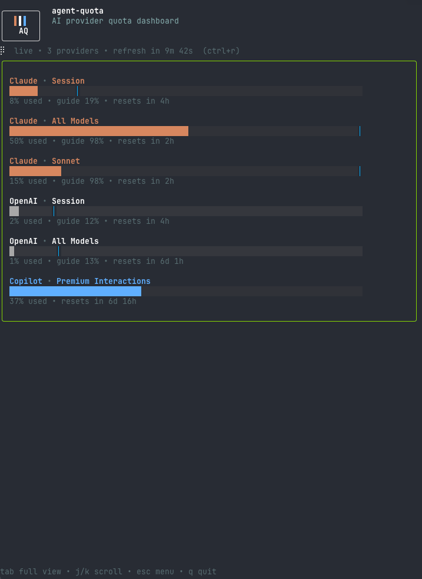

# Agent Quota Dashboard

CLI tool that fetches AI provider usage/quota data.

Pretty TUI for humans, headless JSON for scripts and agents.

> Linux x86_64 only for now.
> The supported install paths in this repo target Linux x86_64 only. Manual `go build` / `go install` may still work on other platforms, but that is unsupported.

## Quick View Example

<p align="center">
  
</p>

## Install

### Prebuilt binary

The standard release path is:
- GitHub Actions builds Linux x86_64 binaries on tagged releases
- GitHub Releases hosts the archives and checksums
- `install.sh` downloads the correct archive for Linux x86_64

Install the latest Linux x86_64 release:

```bash
#  `~/.local/bin`
curl -fsSL https://raw.githubusercontent.com/rudolfjs/agent-quota/main/scripts/install.sh | sh
# /usr/local/bin
curl -fsSL https://raw.githubusercontent.com/rudolfjs/agent-quota/main/scripts/install.sh | BIN_DIR=/usr/local/bin sh
# Install a specific Linix x86_64 release version:
curl -fsSL https://raw.githubusercontent.com/rudolfjs/agent-quota/main/scripts/install.sh | VERSION=v0.1.1 sh
# Skip the confirmation prompt:
curl -fsSL https://raw.githubusercontent.com/rudolfjs/agent-quota/main/scripts/install.sh | YES=1 sh
```

### Install with Go or build form source

This may work outside Linux x86_64 too, but only Linux x86_64 is supported right now.

```bash
# Go
go install github.com/rudolfjs/agent-quota/cmd/agent-quota@latest
# Source
go build -o agent-quota ./cmd/agent-quota/
```

## Usage

`aq` is installed as a short alias for `agent-quota`.

```bash
aq                            # pretty TUI dashboard
aq --refresh-minutes 5
aq --json                     # one-shot JSON
aq -p claude                  # one-shot JSON for a single provider
aq -p copilot                 # GitHub Copilot CLI quota
aq status                     # one-shot JSON for scripts
```

## Config

Default config paths:

```text
~/.config/agent-quota/providers.json
~/.config/agent-quota/settings.json
```

Provider selection example:

```json
{
  "providers": ["claude", "gemini", "openai", "copilot"]
}
```

TUI settings example:

```json
{
  "provider_order": ["claude", "openai", "gemini", "copilot"],
  "tui": {
    "hide_header": false,
    "refresh_minutes": 15
  }
}
```

## Provider setup

- Claude: `claude` CLI login (if 429 or 403 errors occur, re-authenticate Claude Code to get a new OAuth token)
- OpenAI: `codex login`
- Gemini: `gemini` CLI login
- Copilot: `copilot login`

## Development

```bash
make install-deps     # first time: install tools, hooks, and module deps
make release-check
make build
```

See [CONTRIBUTING.md](CONTRIBUTING.md) for the full development, changie, and release workflow.
