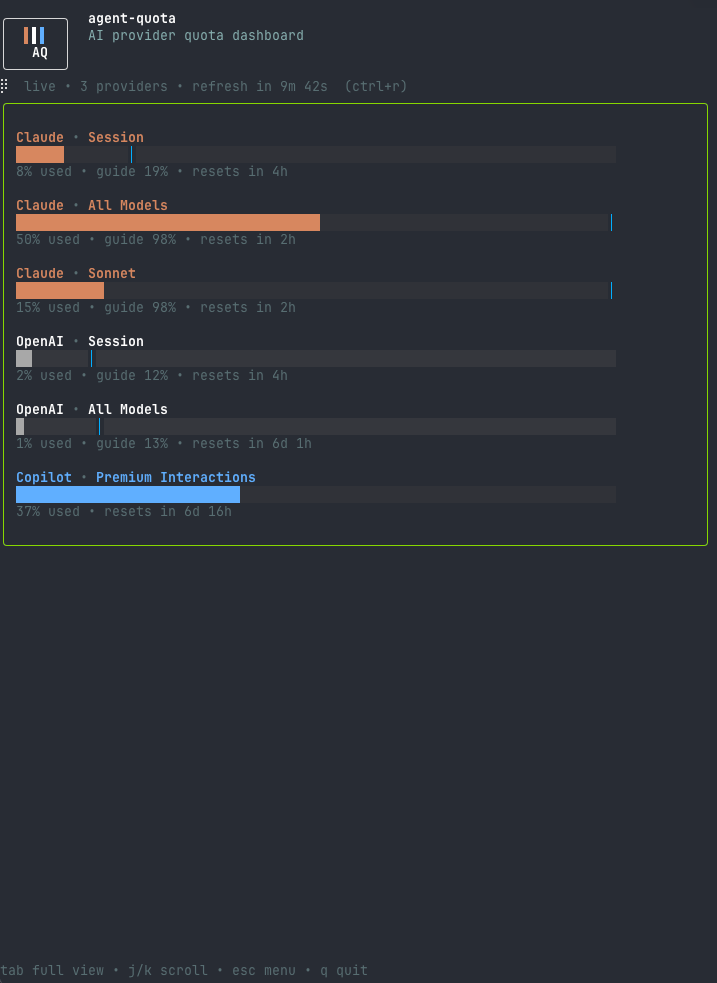

# Agent Quota Dashboard

CLI tool that tracks AI provider **OAuth subscription** quotas and usage limits — the rate limits you hit when using tools like Claude Code, GitHub Copilot, and other AI assistants through their CLI/IDE integrations.

Pretty TUI for humans, headless JSON for scripts and agents.

> **Not for API usage.** This tool reads the OAuth-based subscription quotas exposed by provider CLIs, not API key billing. If you pay per-token via the API, this isn't the tool for you.

> Supports Linux x86_64 and macOS Intel / Apple Silicon. On Windows, use WSL2 (x86_64); native PowerShell is unsupported because this tool relies on Unix-style provider CLI credential stores.

## Quick View Example

<p align="center">
  
</p>

## Install (Linux and Mac)

### Prebuilt binary

The standard release path is:
- GitHub Actions builds Linux x86_64, macOS Intel (`darwin/amd64`), and macOS Apple Silicon (`darwin/arm64`) binaries
- GitHub Releases hosts the archives and checksums
- `install.sh` detects your platform and downloads the matching archive
- `aq self-update` uses the same platform archives with SHA-256 verification and atomic replacement

Use the **same command on Linux and Mac**. The installer automatically detects your operating system and architecture (including Intel and Apple Silicon Macs) and installs the latest matching release into `~/.local/bin`:

```bash
curl -fsSL https://raw.githubusercontent.com/rudolfjs/agent-quota/main/scripts/install.sh | sh
```

The installer also creates an `aq` shortcut beside `agent-quota`. With `~/.local/bin` on your `PATH`, run `aq` from any shell; no shell alias is needed.

Custom installation options (the same on Linux and Mac):

```bash
# /usr/local/bin
curl -fsSL https://raw.githubusercontent.com/rudolfjs/agent-quota/main/scripts/install.sh | BIN_DIR=/usr/local/bin sh
# Install a specific release version (Mac archives require a release with macOS support):
curl -fsSL https://raw.githubusercontent.com/rudolfjs/agent-quota/main/scripts/install.sh | VERSION=v0.1.1 sh
# Skip the confirmation prompt:
curl -fsSL https://raw.githubusercontent.com/rudolfjs/agent-quota/main/scripts/install.sh | YES=1 sh
```

### Install with Go or build from source

Go 1.25+ is required. macOS builds do not require CGO or an additional Keychain library.

```bash
# Go
go install github.com/rudolfjs/agent-quota/cmd/agent-quota@latest
# Source
go build -o agent-quota ./cmd/agent-quota/
```

## Usage

The installer and `make local-install` create `aq` as a shortcut for `agent-quota`. A direct `go install` or `go build` creates only the `agent-quota` binary.

```bash
aq                            # pretty TUI dashboard
aq --refresh-minutes 5
aq --json                     # one-shot JSON
aq -p claude                  # one-shot JSON for a single provider
aq -p copilot                 # GitHub Copilot CLI quota
aq status                     # one-shot JSON for scripts
```

## Config

Default config paths:

```text
~/.config/agent-quota/providers.json
~/.config/agent-quota/settings.json
```

Provider selection example:

```json
{
  "providers": ["claude", "openai", "copilot"]
}
```

TUI settings example:

```json
{
  "provider_order": ["claude", "openai", "copilot"],
  "tui": {
    "hide_header": false,
    "refresh_minutes": 15
  }
}
```

## Provider setup

- Claude: `claude` CLI login (if 429 or 403 errors occur, re-authenticate Claude Code to get a new OAuth token)
- OpenAI: `codex login`
- Copilot: `copilot login`

### macOS Keychain access

On macOS, `aq` reads existing CLI credentials through Apple's `/usr/bin/security`:

- **Claude Code:** `Claude Code-credentials` (or the CLI's config-directory-specific entry), with file fallback in the same credential profile. `CLAUDE_SECURESTORAGE_CONFIG_DIR` overrides `CLAUDE_CONFIG_DIR` for both stores; an empty secure-storage override selects `~/.claude`. Account names outside `[a-zA-Z0-9._-]` use the CLI's `claude-code-user` fallback.
- **ChatGPT / Codex:** follows the root `cli_auth_credentials_store` setting in `CODEX_HOME/config.toml` (default home `~/.codex`). `file` (the default) reads only `auth.json`; `keyring` reads only `Codex Auth`; `auto` prefers Keychain and falls back to `auth.json` when the entry is absent. `ephemeral` has no saved login to read. Only the direct Keychain backend is supported; Codex's encrypted secrets backend and configuration overrides from other layers are not interpreted.
- **GitHub Copilot CLI:** `copilot-cli`, using the host/login in `~/.copilot/config.json`. Environment tokens and `storeTokenPlaintext` in the adjacent `settings.json` remain supported. The legacy `store_token_plaintext` preference in `config.json` is used only when `settings.json` is absent. Installing `gh` alone does not configure the Copilot CLI provider.

The first password read **may show a macOS permission prompt naming “security”**, depending on the entry's access rules. Choose **Allow** for this request. **Always Allow** may avoid later prompts, but trusts the `security` tool, not exclusively `aq`; prompts can recur when a provider recreates its entry. Already-authorized entries may not prompt at all. Unlock your login Keychain first; unattended/SSH runs cannot approve an interactive dialog.

`aq` only reads these Keychain entries. It never changes their access rules, logs tokens, or copies Keychain credentials into files. Denying access produces an authentication error, not a silent file fallback. Claude refresh still runs the Claude CLI; expired Keychain-backed Codex credentials require `codex login` again. Existing file-backed OpenAI refresh is unchanged.

On Linux, Copilot keeps using environment or file credentials and does not read macOS Keychain preferences from `settings.json`.

## Development

```bash
make install-deps     # first time: install tools, hooks, and module deps
make release-check
make build
```

See [CONTRIBUTING.md](CONTRIBUTING.md) for the full development, changie, and release workflow.

## License

[MIT](LICENSE) © 2026 Rudolf J.
